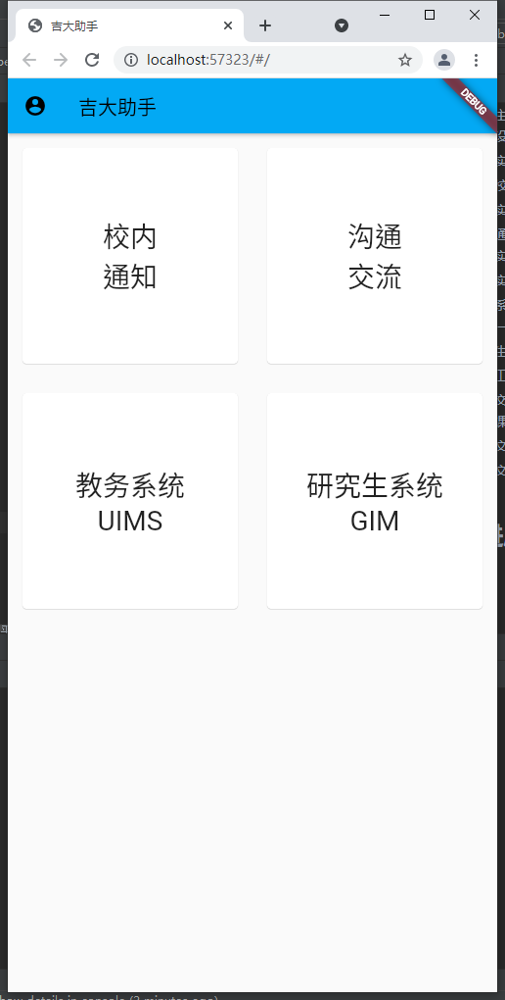

# jlu_helper

这是一个力图整合您在吉林大学校园中生活需要的绝大多数信息服务的项目。

## 缘由

得益于我吉无数先辈们的无私奉献，在github上存在众多的针对学校各个系统的脚本，但由于其使用存在一定的技术门槛且大多由不同的同学开发比较分散，故一直想做这样一个项目将各位大佬的成果结合起来。

## Getting Started

### Windows

### Mac

### Linux

### IOS

### Android

## 功能

## TODO

- [ ] 构建主界面
  - [x] 设计交互
  - [ ] 实现登陆功能
  - [ ] 校内推广
  - [ ] 实现插件化
  - [x] 响应式UI
  - [ ] UI美化
- [x] 校内通知
  - [x] 实现查看功能
  - [ ] 实现订阅功能
- [ ] 教务系统UIMS
  - [ ] 一键评价
- [ ] 研究生管理系统GIM
- [ ] 实用工具
- [ ] 校内交流
  - [ ] 失物招领
  - [ ] 墙
  - [ ] 课表获取
  - [ ] 文件互传
  - [ ] 文件分享
- [ ] 多系统支持
  - [x] Android
  - [ ] IOS
  - [x] Windows
  - [ ] Linux
  - [ ] MacOS
  - [x] Web

## 当前进度

## 备注

技术栈采用flutter来一次编码适配全平台，避免重复劳动

采用插件化来灵活管理功能，实现集成众人的智慧

欢迎各位大佬加入该项目，企鹅群：466025497

## License
MIT